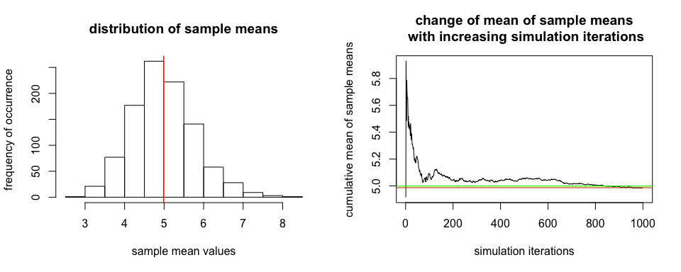
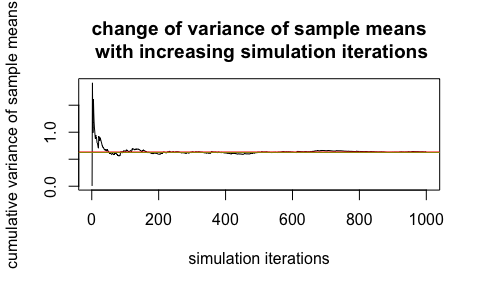
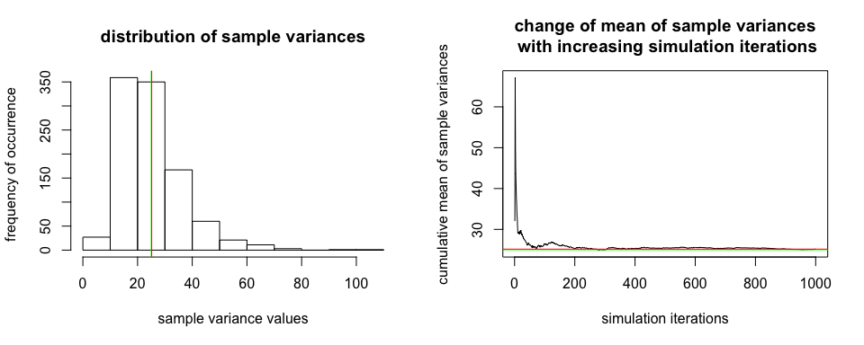
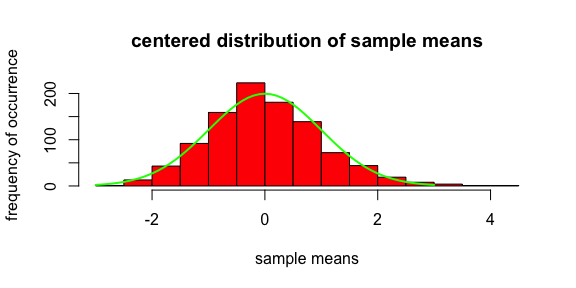

# Asymptotic Properties of the Exponential Distribution
joergandi  
July 25 2015  

## Overview
We investigate the asymptotic properties of the exponential distribution when repeatedly drawing a large number of samples with fixed sample size from that distribution. Specifically, we look at sample mean, sample variance and sample mean distribution.

_Note: We chose to interleave text, code and figures into a total of 4 pages, instead of using max.3 pages of text with max.3 additional pages of appendix for figures and code._

## Simulations

```r
set.seed(42)
lambda<-0.2
n<-40
numsamples<-1000
```
We use an exponential distribution with a lambda of 0.2 and draw 1000 sample sets with a size of 40 each, using a for loop. For each loop iteration, we store mean and variance of that sample. We set a fixed seed for random number generation to generate a reproducible report.


```r
mns = NULL
vrs=NULL
theo_sd = 1/lambda
theo_m = 1/lambda
for (i in 1 : numsamples) {
  d=rexp(n,rate=lambda)
  mns = c(mns, mean(d))
  vrs = c(vrs, var(d))
}
```

## Sample Mean vs Theoretical Mean


```r
mmns=mean(mns) #mean of sample means approx distr mean
m=cumsum(mns)/(1:length(mns)) #accumulated up to each simulation iteration
```

The theoretical mean of an exponential distribution with a lambda of 0.2 should be 5. The following figure shows the distribution of the means for each sample (left) and illustrates (right) that with an increasing number of simulation iterations, the mean of the sample mean distribution 4.9865083 (red) approaches the theoretical mean of the population (green).


```r
par(mfrow = c(1, 2)) 
hist(mns,xlab = "sample mean values", 
         ylab="frequency of occurrence",
         main="distribution of sample means")
abline(v = theo_m, col = "green")
abline(v = mmns, col = "red")
plot(m,ylab="cumulative mean of sample means", 
       xlab="simulation iterations",
       main="change of mean of sample means\n with increasing simulation iterations",
       type="n")
lines(m,type="l")
abline(h = theo_m, col = "green")
abline(h = mmns, col = "red")
```

 

<!-- NOT commented out for size reasons --> 


```r
# var of sample means
vmns=sum((mns-rep(mmns,length(mns)))^2)/(length(mns))
# cumulative var of sample means
vv=cumsum((mns-rep(mmns,length(mns)))^2)/(1:length(mns))
theo_vm=theo_sd^2/n  #approached by (sd/sqrt(n))^2
```

With increasing sample size, the variance of the sample mean distribution should reduce; for the given sample size 40, it can be computed as 0.625. The following figure shows that with a sufficient number of simulations, the variance of the sample means 0.6338061 (red) approaches its theoretical value (green) for the given sample size 40.


```r
plot(vv,ylab="cumulative variance of sample means", 
       xlab="simulation iterations",
       main="change of variance of sample means\n with increasing simulation iterations",
       type="n")
lines(vv,type="l")
abline(h = theo_vm, col = "green")
abline(h = vmns, col = "red")
```

 

## Sample Variance vs Theoretical Variance


```r
mvrs=mean(vrs) #mean of sample vars = distr var, sd=sqrt(mvrs)
v=sqrt(cumsum(vrs)/(1:length(vrs)))  # accumulated up to each simulation iteration
```

The theoretical variance of an exponential distribution with a lambda of 0.2 should be 25. The following figure shows the distribution of the variance for each sample (left) and illustrates (right) that with an increasing number of simulation iterations, the mean of the sample variance distribution 25.165914 approaches the theoretical variance of the population.


```r
par(mfrow = c(1, 2)) 
hist(vrs,xlab = "sample variance values", 
         ylab="frequency of occurrence",
         main="distribution of sample variances")
abline(v = theo_sd^2, col = "green")
abline(v = mvrs, col = "red")
plot(v^2,ylab="cumulative mean of sample variances", 
       xlab="simulation iterations",
       main="change of mean of sample variances\n with increasing simulation iterations",
       type="n")
lines(v^2,type="l")
abline(h = theo_sd^2, col = "green")
abline(h = mvrs, col = "red")
```

 

## Distribution

We woud like to confirm that the distribution of sample means approaches a normal distribution. We center and normalize the sample mean distribution by subtracting its mean and dividing by its standard deviation; the resulting distribution should follow a normal distribution N(0,1). The following figure shows the whitened distribution with the N(0,1) distribution overlayed (we have to scale the normal curve since the histogram shows frequencies and not probabilities). As can be seen, the sample mean distribution approaches the normal distribution reasonably well.


```r
#objective: (sample means - mean of sample means )/(sd of sample means) ~N(0,1)
h=hist((mns-rep(mmns))/sqrt(vmns),
         xlab = "sample means", 
         ylab="frequency of occurrence",
         main="centered distribution of sample means",
         col="red")
#overlay with scaled normal density curve
scale = max(h$counts/h$density)
x=seq(-3,3,.1)  
y=dnorm(x,0,1)
lines(x,y*scale,col="green",lwd=2)
```

 


