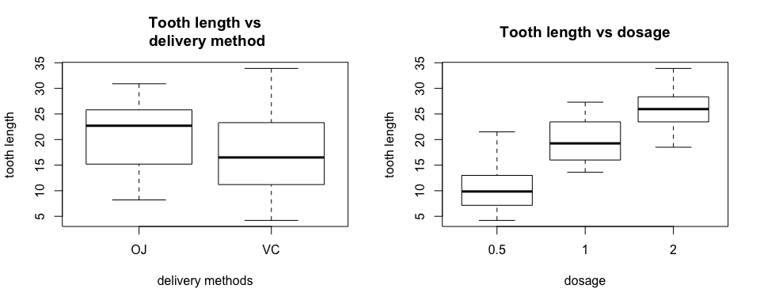
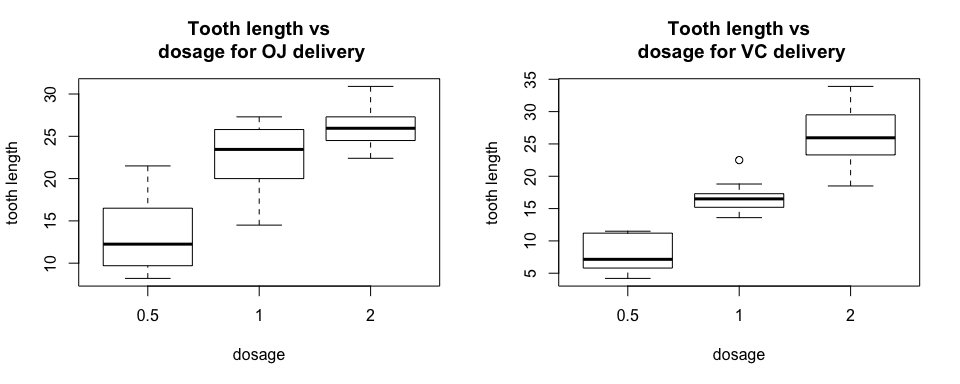

# Analysis of the ToothGrowth Dataset
joergandi  
July 25 2015  

## Overview
The ToothGrowth dataset is a built-in R dataset. It contains data on the length of odontoblasts (teeth) in each of 10 guinea pigs at each of three dose levels of Vitamin C (0.5, 1, and 2 mg) with each of two delivery methods (orange juice or ascorbic acid). The objective of this analysis is to investigate the effect of different dosage and different delivery methods on the tooth length.

_Note: We chose to interleave text, code and figures into a total of 6 pages, instead of using max.3 pages of text with max.3 additional pages of appendix for figures and code._

## Exploratory Analysis

We load the built-in dataset and show basic statistics (mean, quartiles, 95% confidence intervals) for tooth length over delivery method or dosage.


```r
data(ToothGrowth)
par(mfrow = c(1, 2)) 
boxplot(ToothGrowth$len ~ ToothGrowth$supp,
        xlab="delivery methods",
        ylab="tooth length",
        main="Tooth length vs\n delivery method")
boxplot(ToothGrowth$len ~ ToothGrowth$dose,
        xlab="dosage",
        ylab="tooth length",
        main="Tooth length vs dosage")
```

 

Since the delivery method seems to impact the tooth length, we show the dosage influence separately for each delivery method. 


```r
t=split(ToothGrowth,ToothGrowth$supp)
par(mfrow = c(1, 2)) 
boxplot(t$OJ$len~t$OJ$dose,
        xlab="dosage",
        ylab="tooth length",
        main="Tooth length vs\n dosage for OJ delivery")
boxplot(t$VC$len~t$VC$dose,
        xlab="dosage",
        ylab="tooth length",
        main="Tooth length vs\n dosage for VC delivery")
```

 

## Basic dataset summary

We provide summaries for the overall dataset and basic statistical information for the total set and the subsets wrt delivery method and dosage.


```r
str(ToothGrowth)
```

```
## 'data.frame':	60 obs. of  3 variables:
##  $ len : num  4.2 11.5 7.3 5.8 6.4 10 11.2 11.2 5.2 7 ...
##  $ supp: Factor w/ 2 levels "OJ","VC": 2 2 2 2 2 2 2 2 2 2 ...
##  $ dose: num  0.5 0.5 0.5 0.5 0.5 0.5 0.5 0.5 0.5 0.5 ...
```

```r
summary(ToothGrowth)
```

```
##       len        supp         dose      
##  Min.   : 4.20   OJ:30   Min.   :0.500  
##  1st Qu.:13.07   VC:30   1st Qu.:0.500  
##  Median :19.25           Median :1.000  
##  Mean   :18.81           Mean   :1.167  
##  3rd Qu.:25.27           3rd Qu.:2.000  
##  Max.   :33.90           Max.   :2.000
```

```r
tapply(ToothGrowth$len, ToothGrowth$supp,summary)
```

```
## $OJ
##    Min. 1st Qu.  Median    Mean 3rd Qu.    Max. 
##    8.20   15.52   22.70   20.66   25.72   30.90 
## 
## $VC
##    Min. 1st Qu.  Median    Mean 3rd Qu.    Max. 
##    4.20   11.20   16.50   16.96   23.10   33.90
```

```r
tapply(ToothGrowth$len, ToothGrowth$dose,summary)
```

```
## $`0.5`
##    Min. 1st Qu.  Median    Mean 3rd Qu.    Max. 
##   4.200   7.225   9.850  10.600  12.250  21.500 
## 
## $`1`
##    Min. 1st Qu.  Median    Mean 3rd Qu.    Max. 
##   13.60   16.25   19.25   19.74   23.38   27.30 
## 
## $`2`
##    Min. 1st Qu.  Median    Mean 3rd Qu.    Max. 
##   18.50   23.52   25.95   26.10   27.83   33.90
```

## Analysis of tooth growth wrt delivery method and dosage

### Does tooth growth on average differ significantly between the OJ and the VC delivery methods?


```r
d1=split(ToothGrowth$len,ToothGrowth$supp)
t.test(d1$OJ,d1$VC,paired=FALSE,var.equal = FALSE,conf.level=0.95)
```

```
## 
## 	Welch Two Sample t-test
## 
## data:  d1$OJ and d1$VC
## t = 1.9153, df = 55.309, p-value = 0.06063
## alternative hypothesis: true difference in means is not equal to 0
## 95 percent confidence interval:
##  -0.1710156  7.5710156
## sample estimates:
## mean of x mean of y 
##  20.66333  16.96333
```

```r
pval = t.test(d1$OJ,d1$VC,paired=FALSE,var.equal = FALSE,conf.level=0.95)$p.value
```

We cannot exclude that the tooth growth is the same for both delivery methods with a confidence of at least 95% since 0 is in the 95% confidence interval. However, since the p value is 0.0606345, we could eg. conclude that the tooth growth is bigger on average for the OJ delivery method with a less strict confidence interval of eg. less than 93.9365492% .

### Does larger dosage result in more tooth growth on average, over all delivery methods?


```r
d2=split(ToothGrowth$len,as.factor(ToothGrowth$dose))
t.test(d2$"2",d2$"1",paired=FALSE,var.equal = FALSE,conf.level=0.95)
```

```
## 
## 	Welch Two Sample t-test
## 
## data:  d2$"2" and d2$"1"
## t = 4.9005, df = 37.101, p-value = 1.906e-05
## alternative hypothesis: true difference in means is not equal to 0
## 95 percent confidence interval:
##  3.733519 8.996481
## sample estimates:
## mean of x mean of y 
##    26.100    19.735
```

```r
t.test(d2$"1",d2$"0.5",paired=FALSE,var.equal = FALSE,conf.level=0.95)
```

```
## 
## 	Welch Two Sample t-test
## 
## data:  d2$"1" and d2$"0.5"
## t = 6.4766, df = 37.986, p-value = 1.268e-07
## alternative hypothesis: true difference in means is not equal to 0
## 95 percent confidence interval:
##   6.276219 11.983781
## sample estimates:
## mean of x mean of y 
##    19.735    10.605
```

We can reject equal means for dosage 2 vs dosage 1 with a confidence interval of 95%. A small p value indicates a high probability that the alternate hypothesis, larger tooth growth with dosage 2 than dosage 1, is true (positive confidence interval boundaries). The same holds for dosage 1 vs dosage 0.5.

### Does tooth growth on average differ significantly for the same delivery method, but different dosage?


```r
d3=split(ToothGrowth$len,list(ToothGrowth$supp, as.factor(ToothGrowth$dose)))
t.test(d3$OJ.2,d3$OJ.1,paired=FALSE,var.equal = FALSE,conf.level=0.95)
```

```
## 
## 	Welch Two Sample t-test
## 
## data:  d3$OJ.2 and d3$OJ.1
## t = 2.2478, df = 15.842, p-value = 0.0392
## alternative hypothesis: true difference in means is not equal to 0
## 95 percent confidence interval:
##  0.1885575 6.5314425
## sample estimates:
## mean of x mean of y 
##     26.06     22.70
```

```r
pval21OJ = t.test(d3$OJ.2,d3$OJ.1,paired=FALSE,var.equal = FALSE,conf.level=0.95)$p.value
t.test(d3$OJ.1,d3$OJ.0.5,paired=FALSE,var.equal = FALSE,conf.level=0.95)
```

```
## 
## 	Welch Two Sample t-test
## 
## data:  d3$OJ.1 and d3$OJ.0.5
## t = 5.0486, df = 17.698, p-value = 8.785e-05
## alternative hypothesis: true difference in means is not equal to 0
## 95 percent confidence interval:
##   5.524366 13.415634
## sample estimates:
## mean of x mean of y 
##     22.70     13.23
```

```r
t.test(d3$VC.2,d3$VC.1,paired=FALSE,var.equal = FALSE,conf.level=0.95)
```

```
## 
## 	Welch Two Sample t-test
## 
## data:  d3$VC.2 and d3$VC.1
## t = 5.4698, df = 13.6, p-value = 9.156e-05
## alternative hypothesis: true difference in means is not equal to 0
## 95 percent confidence interval:
##   5.685733 13.054267
## sample estimates:
## mean of x mean of y 
##     26.14     16.77
```

```r
t.test(d3$VC.1,d3$VC.0.5,paired=FALSE,var.equal = FALSE,conf.level=0.95)
```

```
## 
## 	Welch Two Sample t-test
## 
## data:  d3$VC.1 and d3$VC.0.5
## t = 7.4634, df = 17.862, p-value = 6.811e-07
## alternative hypothesis: true difference in means is not equal to 0
## 95 percent confidence interval:
##   6.314288 11.265712
## sample estimates:
## mean of x mean of y 
##     16.77      7.98
```

The result from the previous analysis over all delivery methods also holds within each delivery method separately. Higher dosage seems to result in increased tooth growth on average. However, there is stronger evidence for this hypothesis for the VC delivery method (smaller p values) than for the OJ delivery method:  a larger p value of 0.0391951 for dosage 2 vs dosage 1 means instead that the _null_ hypothesis of _no difference on average between dosage 2 and dosage 1 for OJ delivery_ would be _confirmed_ if we required only a slightly _stricter confidence interval_ for this test, eg. above 96.0804858%).

## Conclusions and assumptions

Based on this dataset, higher dosage of Vitamin C appears to result on average in more tooth growth for both delivery methods. 

For the above tests, we assume that 

- the teeth length per group are approximately normally distributed or that they at least follow an approximately symmetric distribution; 

- test results between groups cannot be paired,

- the variance of each group is not assumed equal,

- a t-test instead of a z-test is used since we have relatively few observations.


